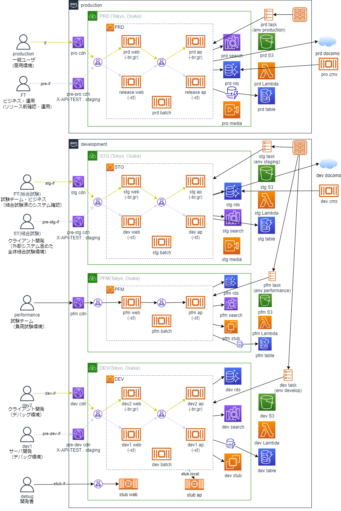
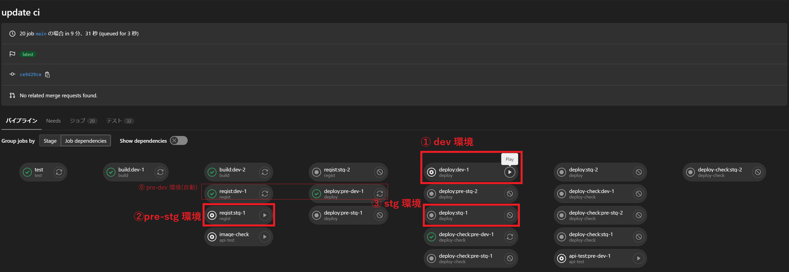

# 複雑な分岐と判断タイミングを加味したCI/CDの実現

## 前提

### デプロイ対象システム構成

商用、STG、検証など複数の環境が存在し、各環境への柔軟なデプロイが求められる。
また、３０以上のマイクロサービスで構成されるため、CI/CD WFの効率的な運用が求められる。

### ブランチ・CI/CD戦略

環境間で想定外の差分を発生させない様にするため、各環境用のリリースブランチは用意せず、Github-flowに準拠したブランチ戦略を採用する。
また、各環境へのデプロイ判断は手動で実行できるようにする。

* 開発~検証環境
  defaultブランチ(main)へのPushで開発環境(dev)へ自動デプロイ
  以降の環境へは、JOBの手動実行機能を用いて任意のタイミングでデプロイ

* 商用環境
  リリースタグ( release_pro_yyyymmdd )をPushして、商用直前環境へデプロイ
  商用公開は手動実行

### Gitlab Pipeline

Gitlab CI/CDを利用し、各環境へのデプロイを実現している。

### JavaのライブラリPJとアプリPJ

JavaライブラリPJのPackagesにてMavenパッケージを管理し、
JavaアプリPJのCI/CDワークフロー及びローカルから、JavaライブラリPJのMavenリポジトリにアクセスしている。

## 課題

* GitHub Actionsのワークフローにて、複雑な分岐及び途中での実行タイミングの制御
  Gitlab CI/CD で実現していた、Push後のBuild, Test, dev環境へのDeployまでは自動実行しつつ、stg環境へのDeployは手動実行とする仕組みを再現できない？
  また、Deployが完了した前提で、必要に応じて切り戻しを行う仕組みを再現できない？
* GitHub Organizations内のMavenリポジトリへの`GITHUB_TOKEN`の利用
  ローカルからの参照はPAT(`personal access token (classic)`)で良いが、Actions内での参照は`GITHUB_TOKEN`を利用したいが、対応していなさそう？
  [GitHub Packages への認証を行う](https://docs.github.com/ja/packages/working-with-a-github-packages-registry/working-with-the-gradle-registry#github-packages-%E3%81%B8%E3%81%AE%E8%AA%8D%E8%A8%BC%E3%82%92%E8%A1%8C%E3%81%86)

